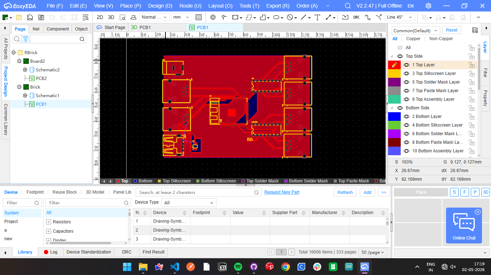
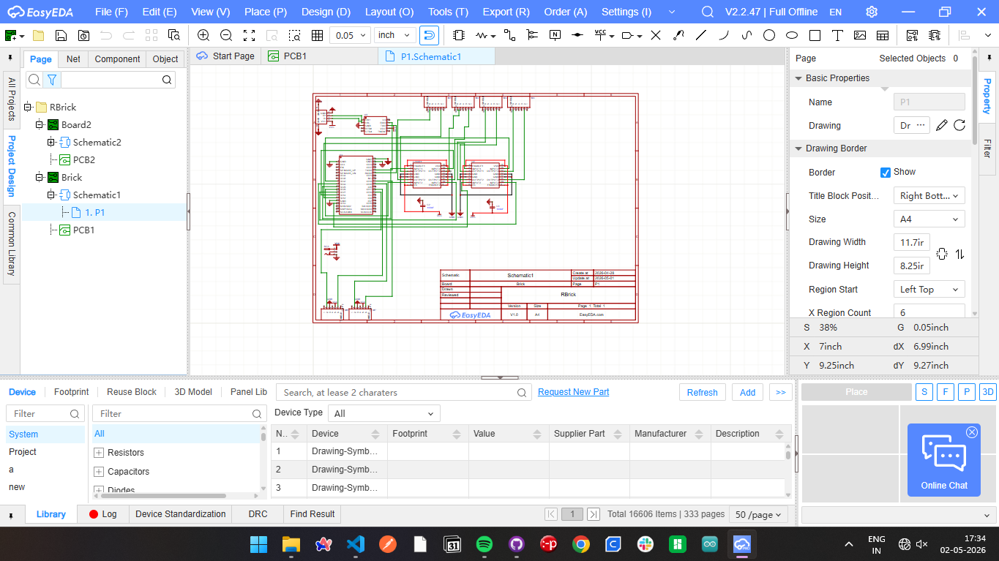

# RBrick

RBrick is an open-source Lego-Mindstorm Alternate based on ESP-Wroom32 chip with its custom programming software. This is also the first PCB project that I've made.

For now, it needs to programmed using Arduino IDE, but in future, I'll be making a drag-and-drop interface for it.

Features-
 - Built-in wifi and bluetooth support
 - 4 RJ11 based motor pins connected to L293 Motor Drivers
 - 2 RJ11 pins for sensors
 - Supports distance(ultrasonic) sensor, IR sensor, Thermistor, etc.
 - Has USB 2.0 port for programming
 - A power jack for 3.3V power supply.

Upcoming Features - 
 - Python based programming IDE with drag-and-drop interface.
 - Inbuilt touchscreen display for on-board programming

List of components needed 
 - 1x ESP Wroom32
 - 6x RJ11 Ports
 - 1x DC Power Jack
 - 1x USB 2.0
 - 1x CH340E
 - 2x L293 Motor Drivers

The PCB EasyEDA project files and the Gerber file are linked in the Repo.

